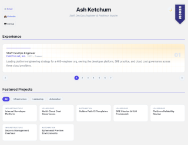

# Interactive Resume — User Guide

A single-file, self-contained interactive résumé built with React and YAML. No build tools, no server required — open `index.html` in any browser and it works.

---

## Quick Start

1. Copy `index.html` to any folder.
2. Open it in a browser.
3. Edit the YAML block inside the file to add your own content (see below).

That's it. There are no dependencies to install and no build step.

---

## How It Works

All résumé content lives inside a `<script type="text/yaml">` block embedded directly in `index.html`. The browser ignores this tag (it doesn't recognise the type), and the React app reads and parses it at runtime using the [js-yaml](https://github.com/nodeca/js-yaml) library, which is loaded from a CDN.

Because everything is self-contained in one file, you can host it anywhere that serves static HTML — GitHub Pages, Netlify, S3, or just a file attachment.

---

## Editing the YAML

Open `index.html` in any text editor and jump to **line 431** — you'll find the `<script type="text/yaml" id="resume-data">` block. Everything inside it controls what appears on the page.

The block has five sections, described below.

---

### 1. `candidate` — Personal Info

```yaml
candidate:
  name: "Ash Ketchum"
  description: "Staff DevOps Engineer & Pokémon Master"
  email: "ash@catchmall.io"
  linkedin: "https://linkedin.com/in/ashketchum"
  github: "https://github.com/ashketchum"
```


| Field         | Required | Description                                                  |
| ------------- | -------- | ------------------------------------------------------------ |
| `name`        | ✅        | Displayed as the large heading in the page header            |
| `description` | ✅        | Subtitle shown below the name                                |
| `email`       | optional | If present, an **Email** button appears linking to `mailto:` |
| `linkedin`    | optional | If present, a **LinkedIn** button appears linking to the URL |
| `github`      | optional | If present, a **GitHub** button appears linking to the URL   |


Omit or leave blank any of `email`, `linkedin`, or `github` to hide that button entirely.

---

### 2. `experience` — Job History

```yaml
experience:
  - id: "job0"
    title: "Staff DevOps Engineer"
    company: "Catch'm All, Inc."
    period: "2022 - Present"
    description: "Leading platform engineering strategy for a 400-engineer org..."

  - id: "job1"
    title: "Senior DevOps Engineer"
    company: "Silph Co."
    period: "2019 - 2022"
    description: "Designed and operated the CI/CD platform serving 150+ engineers..."
```

Jobs are displayed in a carousel, in the order they appear in this list.


| Field         | Description                                                                                                                                      |
| ------------- | ------------------------------------------------------------------------------------------------------------------------------------------------ |
| `id`          | A unique stable key (e.g. `"job0"`) that links this job to its projects. **Do not change** an existing `id` — it will break the project mapping. |
| `title`       | Job title shown on the carousel card                                                                                                             |
| `company`     | Employer name                                                                                                                                    |
| `period`      | Date range string, e.g. `"2022 - Present"` or `"2019 - 2022"`                                                                                    |
| `description` | One or two sentences summarising the role                                                                                                        |


**Adding a job:** append a new entry at the bottom of the list (or wherever you want it to appear in the carousel) with a unique `id`, then add a matching key under `projects` (see section 5).

**Removing a job:** delete the entry here and its matching key under `projects`.

**Reordering jobs:** move the entries freely — the carousel follows the list order.

---

### 3. `show_demos` — Demos Ribbon

```yaml
show_demos: true   # show the ribbon
show_demos: false  # hide the ribbon
```

Controls whether the **Demos!** bookmark ribbon appears in the top-right corner of the page. It links to `demos.html`, which must exist in the same folder as `index.html` for the link to work. Defaults to `true` if omitted.

---

### 4. `project_categories` — Filter Button Order *(optional)*

```yaml
project_categories:
  - Infrastructure
  - Automation
  - Leadership
  - Development
```

Controls the order of the filter buttons above the project grid. If this section is omitted entirely, the buttons are derived automatically from the `cat` values on each project card in the order they first appear.

Either way, you never need to update this list when adding a new category — just use a new `cat` value on a project card and the button appears automatically.

---

### 5. `projects` — Featured Project Cards

```yaml
projects:
  job0:
    - title: "Internal Developer Platform"
      cat: "Infrastructure"
      desc: "Designed and launched an IDP built on Backstage..."

    - title: "Multi-Cloud Cost Governance"
      cat: "Leadership"
      desc: "Established a FinOps practice across AWS, GCP, and Azure..."

  job1:
    - title: "Kubernetes Platform Migration"
      cat: "Infrastructure"
      desc: "Led the 18-month migration of a 60-service Ruby monolith..."
```

Projects are grouped by job using the same `id` values defined in `experience`. Each job can have any number of project cards.


| Field   | Description                                                                  |
| ------- | ---------------------------------------------------------------------------- |
| `title` | Project name shown on the card                                               |
| `cat`   | Category label — drives the filter buttons automatically                     |
| `desc`  | Full description shown in the popup when a card is clicked. No length limit. |


The special key `demos` maps to the **Demos!** ribbon card:

```yaml
  demos:
    - title: "Platform Health Dashboard"
      cat: "Automation"
      desc: "A live demo of the internal developer platform health dashboard..."
```

---

## Features

### Experience Carousel

Jobs are displayed one at a time in a card carousel. Navigate with the arrow buttons or the numbered dot indicators. Each card has a unique background style — the palette cycles automatically, so adding or removing jobs never requires any CSS changes.

### Featured Projects

Below the carousel, project cards for the currently selected job are shown in a grid. Hover over a card to see a highlight effect; click to open a popup with the full description. Close the popup with the **✕** button, by clicking the dimmed backdrop, or by pressing **Escape**.

### Project Filtering

Filter buttons above the grid let you narrow cards by category. The **All** button always appears first; the rest are derived from the `cat` values in the active job's projects. The filter resets to **All** automatically when you navigate to a different job.

### Dark Mode

A moon/sun toggle button in the top-right corner switches between light and dark themes.

---

## Adding Carousel Slide Styles

The carousel backgrounds are defined in the `SLIDE_PALETTES` array in the JavaScript section of `index.html`. Each entry is an object with two fields:

```js
// amber + square grid
{ grad: 'radial-gradient(...), linear-gradient(...)', size: '100% 100%, 28px 28px, 28px 28px' },
```


| Field  | Description                                                         |
| ------ | ------------------------------------------------------------------- |
| `grad` | One or more CSS gradient layers as a comma-separated string         |
| `size` | `backgroundSize` value; use `''` to leave it as the browser default |


To add a new style, append a new `{ grad, size }` object to the array. The palette currently has 9 styles and cycles via `index % length`.

---

## File Structure

If you want to use the Demos ribbon, place both files in the same folder:

```
my-resume/
├── index.html      ← the résumé (this file)
└── demos.html      ← your demos page (you provide this)
```

No other files are needed. All dependencies (React, Babel, js-yaml) are loaded from CDNs at runtime.

---

## Hosting

Because `index.html` is fully self-contained, it can be hosted anywhere static files are served:

- **GitHub Pages** — push to a repo and enable Pages in the repository settings.
- **Netlify / Vercel** — drag-and-drop the file in the dashboard.
- **Amazon S3** — upload and enable static website hosting on the bucket.
- **Local** — just double-click the file. No server needed.